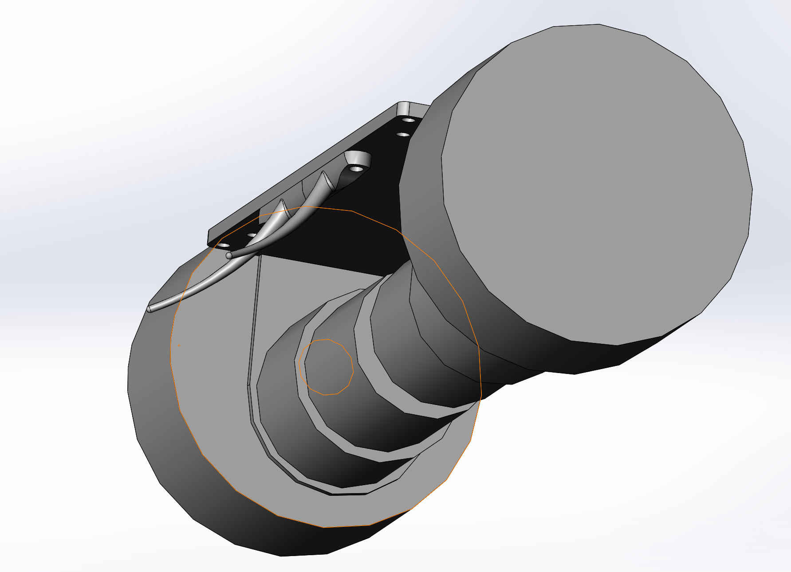
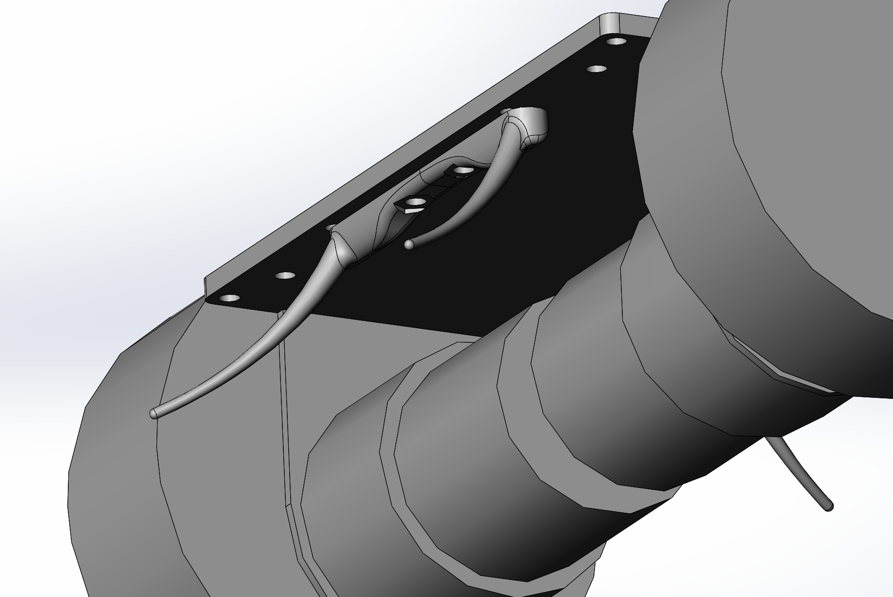

## Stabiliser designs for self balancing robot

[Versions 1](robot_stabiliser.STL)
> Allows for 30 degree tilt from vertical.  
> Uses two bespoke predrilled holes in the supporting plate.  
> Design can be used on either side of robot.  

[Version 2](robot_stabiliser_2.STL)
> Allows for 30 degree tilt from vertical.  
> Uses the premachined slot on support plate, moving support legs away from centre point.  
> Design can be used on either side of robot.  

